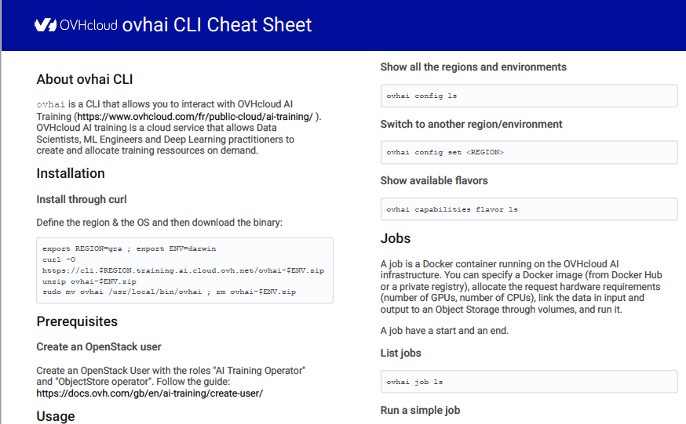

# Cheat sheet for the AI OVHcloud CLI ovhai
 
Here is an example of the cheat sheet:   
 

# Installation

To update the cheat sheet you need to install:
  - [nodejs](https://nodejs.org/)
  - [yargs](http://yargs.js.org/): `$ npm i yargs --save`

# Howto's

To generate the cheat sheet: `$ ./bin/asciidoctorjs-pdf ovhai-cheat-sheet.adoc --template-require ../templates/cheat-sheet/template/template.js`

# Configuration
 
# Hacking
 
You've juste to add / update information in the `ovhai-cheat-sheet.adoc`. 
## Get the sources
 
```bash
    git clone https://github.com/ovh/ovhai-cheat-sheet.git
    cd ovhai-cheat-sheet
```
 
You've developed a new cool feature? Fixed an annoying bug? We'd be happy
to hear from you!
 
Have a look in [CONTRIBUTING.md](https://github.com/ovh/ovhai-cheat-sheet/blob/master/CONTRIBUTING.md)
## Tests
 
The cheat sheet must fit on a A4 page. 

# Related links
 
 * Contribute: https://github.com/ovh/ovhai-cheat-sheet/blob/master/CONTRIBUTING.md
 * Report bugs: https://github.com/ovh/ovhai-cheat-sheet/issues
 * Get latest version: https://github.com/ovh/ovhai-cheat-sheet/blob/master/ovhai-cheat-sheet.pdf
 
# License
 
Copyright 2023 OVH SAS
 
Licensed under the Apache License, Version 2.0 (the "License");
you may not use this file except in compliance with the License.
You may obtain a copy of the License at
 
    http://www.apache.org/licenses/LICENSE-2.0
 
Unless required by applicable law or agreed to in writing, software
distributed under the License is distributed on an "AS IS" BASIS,
WITHOUT WARRANTIES OR CONDITIONS OF ANY KIND, either express or implied.
See the License for the specific language governing permissions and
limitations under the License.